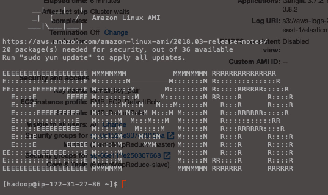

# aws-emr-spark-wc

```
ssh -i "~/key_pair.pem" hadoop@ec2-34-224-93-103.compute-1.amazonaws.com

sudo spark-submit spark-emr-wc.py | tee spark-emr-wc-out.txt

aws s3 cp spark-emr-wc-out.txt s3://spark-emr-wc-bucket/

```

 
 




